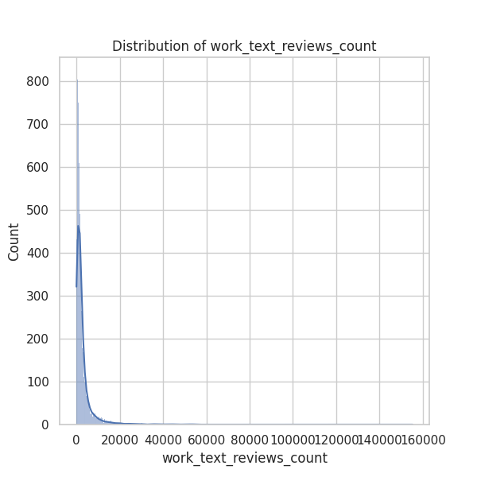

The analysis of the 'goodreads.csv' dataset reveals a wealth of information regarding various aspects of books on Goodreads, including publication years, average ratings, rating distributions, and authorship. Below, I will detail the key insights, trends, anomalies, and potential avenues for further analysis.

### Key Insights and Trends

1. **Books Count and Diversity:**
   - The dataset consists of 10,000 records, with titles written by 4,664 unique authors. This indicates a diverse range of authors and topics available on Goodreads.
   - The **average books count** across listings is approximately 75.71, but with a standard deviation of 170.47, indicating a significant spread in the number of books published by different authors. Some authors have published as many as 3,455 books, hinting at prolific authors who may dominate certain genres.

2. **Publication Year Trends:**
   - The **mean original publication year** is approximately **1982**, with a range spanning from as early as **-1750** to **2017**. This shows a historical spread of literature, but books from the late 20th and early 21st centuries are predominant.
   - There are only **21 missing values** in this column, suggesting most books have a clear publication date. This completeness allows for time-series analyses to identify changes in trends of book releases over decades.

3. **Average Ratings and Popularity:**
   - The average rating sits at approximately **4.0** (with a standard deviation of **0.25**), indicating that most books are well-received, as Goodreads users generally rate positively.
   - A high **ratings_count** suggests that user engagement is a strong aspect of this dataset, with an average count of **54,001** ratings per book. The max ratings count reaches over **4.78 million**, showing that some titles achieve significant traction.
   - There may be a correlation between user engagement (ratings_count) and the number of high ratings (ratings_4 and ratings_5), which could be further explored.

4. **Missing Values Context:**
   - There are several columns with missing values, most notably **isbn** (700 missing), **isbn13** (585 missing), and **original_title** (585 missing). Further investigation into the reasons for these omissions could enhance data quality — for example, some books may not have standardized formatting or digital entries.

5. **Rating Distribution:**
   - The dataset reveals a positive skew in rating distributions, meaning readers tend to give higher ratings more frequently, as indicated by higher means of ratings_4 and ratings_5 compared to ratings_1, ratings_2, and ratings_3.

6. **Language Coverage:**
   - The dominant language code is 'eng' (English), with **6,341 entries** out of a total of **8,916** recorded languages. This linguistic focus implies that non-English titles might represent untapped markets or specific genres that could be analyzed further.

### Anomalies and Outliers

1. **ISBN entries:**
   - The missing values for ISBN numbers might indicate self-published works or books that are not granted an ISBN, which could lead to a reduced discoverability of certain books in broader analyzes.
  
2. **Ratings Outliers:**
   - The max values for ratings_1 to ratings_5 are exceptionally high, signaling potential outliers in either user engagement or promotional actions, particularly for popular titles. 

3. **Book Publication Year Extremes:**
   - The earliest publication year of **-1750** stands out significantly and may warrant correction if it doesn't correspond to an actual book record.

### Suggested Further Analyses

1. **Clustering Analysis:**
   - Utilizing algorithms such as K-means or hierarchical clustering could classify books based on attributes like ratings_count, average rating, and authorship. This analysis may segment books into groups, uncovering hidden patterns in genre preference or author popularity.

2. **Anomaly Detection:**
   - Implement statistical techniques to identify outliers in ratings distribution. This can help in understanding whether certain books are exceptionally praised or criticized and whether such patterns correlate with specific author names or genres.

3. **Time Series Analyses:**
   - An examination of publication trends over time could reveal shifts in genre popularity or spikes in published works. For instance, analyzing the volume of publication per year could highlight market trends in literature, such as a growth in a specific genre.

4. **Text Analysis:**
   - An analysis of the **title** and **original_title** columns, potentially using Natural Language Processing (NLP) techniques, could identify common themes in popular books versus less popular ones. Analyzing text sentiment or keyword frequency across top-rated titles might provide insights into what resonates with readers.

5. **Impact of Authors:**
   - Investigating the relationship between an author's publishing history (measured by books_count) and the average ratings of their works could yield insights on whether prolific authors consistently deliver quality content or if their quality diminishes with quantity.

In summary, the 'goodreads.csv' dataset provides a rich tapestry of information on book publications, ratings, and authorship, offering opportunities for significant insights into the preferences and behaviors of readers. With further analysis, we can uncover the dynamic landscape of literature as reflected through user ratings and publication metrics.

