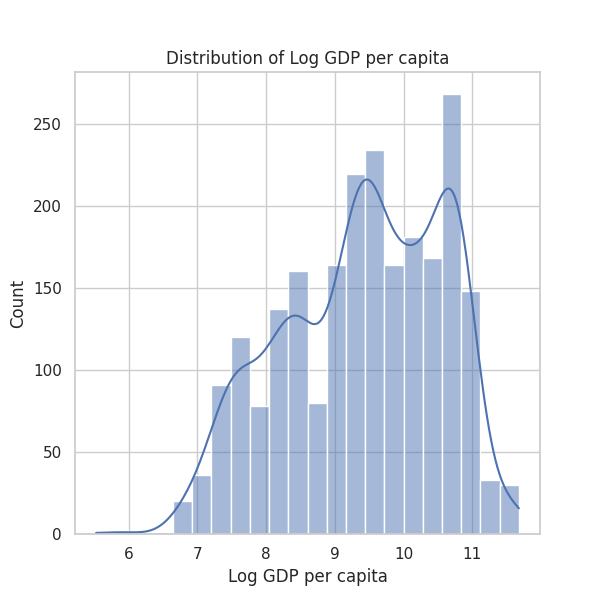
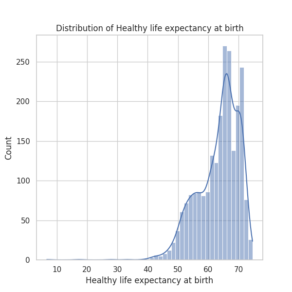
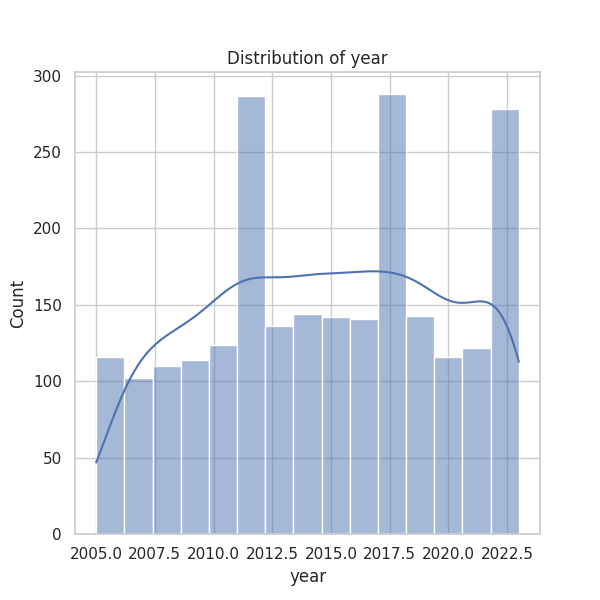

### Insights from the Happiness Dataset Analysis

The data captured in the 'happiness (1).csv' file provides a comprehensive view of various factors contributing to happiness across different countries over a span of years (2005-2023). Below, I detail the key insights derived from the dataset, including trends, outliers, and potential future analyses.

#### 1. **General Trends and Analysis**

- **Temporal Trends**: The average "year" in the dataset is approximately 2014.76, indicating that the majority of records belong to the 2010s, with a standard deviation of about 5.06 years. Notably, this shows a focus on a timeframe where many countries were experiencing recovery from the global financial crises. It would be beneficial to analyze longitudinal changes in happiness indicators, specifically focusing on changes from 2005 to 2023.

- **Life Ladder Trends**: The average "Life Ladder" score is approximately 5.48, which suggests a moderate level of happiness across surveyed countries. The scores range from a minimum of 1.28 to a maximum of 8.02, indicating significant disparities in reported happiness levels. Certain countries, possibly with economic instability or political unrest (e.g., Lebanon, which has the highest frequency of records), might exhibit low Life Ladder scores.

- **Socioeconomic Indicators**: "Log GDP per capita" has a mean value of approximately 9.4. A significant correlation (0.78) exists between "Log GDP per capita" and "Life Ladder," suggesting that economic prosperity contributes significantly to perceived happiness. However, it is important to assess this relationship further, looking at outliers where high GDP does not correspond to high happiness or vice versa.

- **Social Factors**: High levels of "Social support" (mean = 0.81) and "Freedom to make life choices" (mean = 0.75) also correlate positively with the "Life Ladder" scores, with correlations of 0.72 and 0.54, respectively. These findings underscore the importance of social structures and individual autonomy in enhancing public happiness.

- **Negative and Positive Affect**: The mean for "Positive affect" is 0.65 while "Negative affect" stands at 0.27. A higher positive affect and lower negative affect correlate with elevated happiness levels, reinforcing the significance of emotional well-being.

#### 2. **Outliers and Anomalies**

- **Missing Data**: There are notable missing values across the dataset; e.g., "Generosity" has 81 missing entries, which could skew analyses related to social dynamics. Investigating the patterns of missing data will be crucial to ensure comprehensive analysis.

- **Outliers in Life Ladder**: Given the maximum `Life Ladder` score at 8.02 and the minimum at 1.28, countries with particularly low scores should be examined as outliers. These may represent states undergoing crisis or transition, showing how they can substantially affect the happiness metric.

#### 3. **Potential Patterns in Correlations**

- The negative correlation between "Perceptions of corruption" (-0.43) and "Life Ladder" suggests that countries perceived to have high corruption may exhibit lower happiness levels. This aligns with general socio-political theories regarding the impacts of governance on public sentiment.

- **Generosity’s Anomaly**: The average "Generosity" value is near zero, with many values dipping into the negative range. This may signal issues of economic instability impacting philanthropic behavior in certain countries. Further demographic analyses could explain the context of these values.

#### 4. **Suggested Further Analyses**

To deepen the insights derived from this dataset, the following analyses are recommended:

- **Clustering Analysis**: Use clustering algorithms (e.g., K-means) to identify groups of countries with similar happiness profiles. This could reveal specific demographics or economic conditions that correlate with higher happiness scores.

- **Time-series Analysis**: Assess how the happiness indicators change over time within each country. This temporal analysis can help identify patterns of improvement or decline.

- **Anomaly Detection**: Implement anomaly detection techniques to highlight countries that deviate significantly from trends in "Life Ladder" versus GDP or social metrics. This would provide insights into potential crises or growth areas.

- **Predictive Modeling**: Develop predictive models to forecast happiness based on economic indicators, social support, and governmental trust. Understanding these relationships can be essential for policymakers aiming to improve citizen well-being.

- **Geographic Information System (GIS) Analysis**: Mapping the happiness scores against geographic data may illuminate regional patterns in happiness and facilitate understanding of socio-economic factors by location.

In conclusion, while the dataset reveals insightful trends about happiness relative to economic and social factors, targeted analyses can deepen the understanding of these dynamics, paving the way for potential interventions to enhance well-being.

