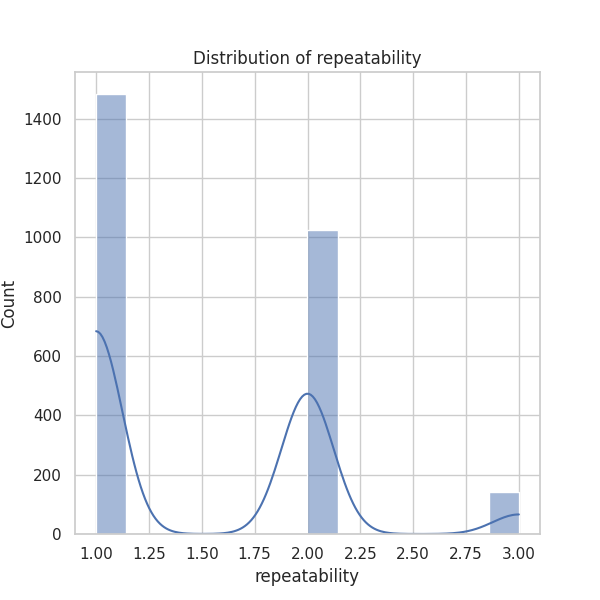
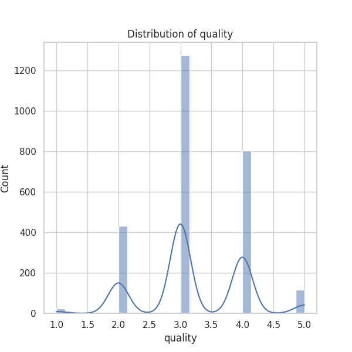
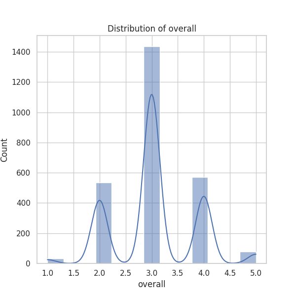
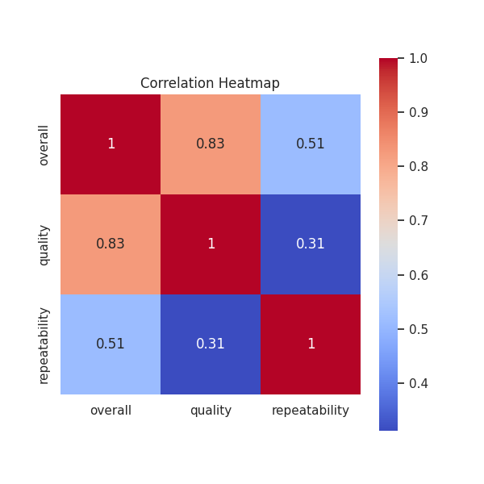

### Narrative of Data Analysis for 'media.csv'

The dataset 'media.csv', comprised of 2652 records across various media types, primarily movies, offers a detailed overview of user reviews and ratings spanning features like date, language, type, title, reviewer, overall score, quality score, and repeatability. Here's an interpretive summary and insights based on the preliminary analysis results of the dataset:

#### Data Overview

1. **Overview of Recorded Entries**:
   - The dataset contains 2,652 entries with data across eight defined columns, ranging from reviews dated as far back as May 21, 2006, to more recent entries. However, the date column suffers from 99 missing values, indicating potential gaps in the timeline of data collection which could skew temporal analyses.

2. **Top Languages and Types**:
   - The dominant language in this dataset is English, comprising 1,306 entries (≈ 49.1%). A wide variety of types is noted, yet the overwhelming majority (≈ 83.4%) are classified as 'movies'.
   - The title 'Kanda Naal Mudhal' appears 9 times, indicating it may be a popular title in this dataset, meriting a deeper exploration into its reception.

3. **Review Trends**:
   - Review metrics exhibit significant overall averages. The mean rating for the overall score is approximately **3.05**, with a standard deviation indicating a reasonable spread of opinions. With ratings ranging from **1 to 5**, the majority of the data clustering around 3 suggests a moderate reception of media reviewed.
   - Quality ratings yield a mean of **3.21**, suggesting a slightly more favorable view on quality than overall impressions.
   - The repeatability score has a mean of approximately **1.49**, indicating that many reviewers did not find the media compelling enough to engage multiple times.

#### Correlation Insights

- There exists a substantial positive correlation between **overall ratings and quality ratings** (0.83), suggesting that higher-quality media tends to receive better overall ratings. Meanwhile, moderate correlation exists between overall ratings and repeatability (0.51), indicating that users who rate media higher are somewhat more likely to recommend it for repeat views.

- The quality ratings relate to repeatability at a lesser degree (0.31), shedding light on an interesting dichotomy where users appreciate quality but may not feel the urge to revisit the media again.

#### Missing Values and Anomalies

- The presence of missing values, especially in the 'date' and 'by' columns, should be addressed. Analyzing how the absence of this data may impact overall trends and insights is essential.
- The reviewer 'Kiefer Sutherland' emerges prominently in the dataset with 48 contributions, warranting an investigative look into whether this name reflects a common trend or bias in reviewers.

#### Patterns & Trends

- The dataset reveals a strong reliability in type and language categorization, with English and movie genres being the most frequent, pointed toward audience preferences.
- Overall scores have a defined clustering feature (0-5), suggesting behavioral patterns in review scores where users tend to stick to middle-ground ratings.

### Suggested Areas for Further Analysis

To glean deeper insights and explore trends, the following analyses are recommended:

1. **Time Series Analysis**:
   - Investigate the distribution of media entries and ratings over time. Understanding how ratings and media types evolve can provide insight into changing audience preferences.

2. **Clustering**:
   - Implement clustering algorithms (e.g., K-means) on overall scores and quality scores to identify distinct groups of media or user preferences. This might highlight specific segments within the data that exhibit unique rating behaviors.

3. **Anomaly Detection**:
   - Deploy anomaly detection techniques to uncover outlier ratings that deviate significantly from norms for overall or repeatability metrics. Identifying and analyzing these anomalies can help in understanding polarized opinions within the dataset.

4. **Sentiment Analysis**:
   - If text data is available (e.g., detailed reviews), conducting a sentiment analysis could unearth the reasons behind certain ratings, providing context to numerical scores.

5. **Comparative Analysis**:
   - Compare ratings across different languages and types to ascertain whether certain demographics show a bias towards particular media forms, potentially informing marketing strategies or content adjustment.

### Conclusion

The analysis of 'media.csv' highlights significant trends in readership and media consumption while identifying crucial areas ripe for further interrogation. By tackling the outlined suggestions and focusing on data integrity, more comprehensive insights can guide future media evaluation strategies. Overall, the data presents an informative snapshot of media interactions within a specified context and timeline, shaping understanding of audience engagement and preferences in the era analyzed.

